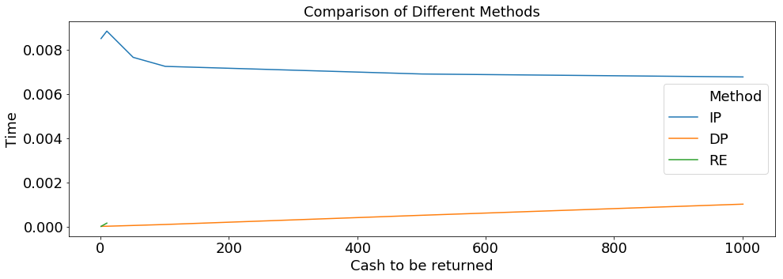
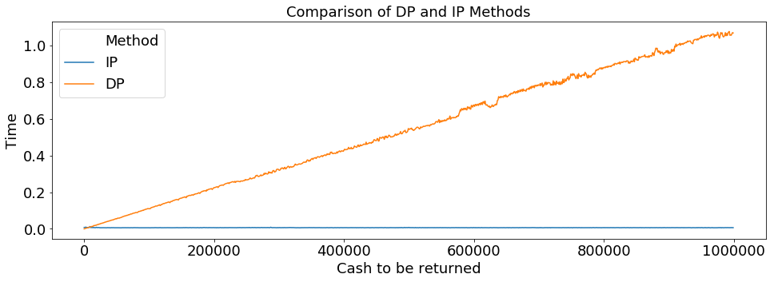

+++
title = "Coin-changing "

date = 2018-04-20T00:00:00
lastmod = 2018-09-28T00:00:00
draft = false

# Authors. Comma separated list, e.g. `["Bob Smith", "David Jones"]`.
authors = ["Konstantinos Bougiatiotis"]

tags = ["Computer Science", "General"]
summary = "Visiting minimum coin changing an Integer Programming Problem"
+++


# Coin-changing (Knapsack problem)

### Solved as an integer programming problem

So a friend of mine was interviewing for a semi-software focused position which had also a time-restricted technical test.

One of the questions asked was something along these lines:

```
A vending machine has been recently installed in your work floor!
Unfortunately, there is a limit in the number of bills it can hold, so the technicians would like a way to give out the minimum amount of change in bills needed.
So, your task is the following:
Write a program that given an initial amount of money (the change to be returned), find the minimum number of bills (of certain denominaions) that add up to it.
Our machine can give back only bills of 1,2,5 and 10$!
```
Pretty straightforward question that many CS students have already seen during their Algorithms101 or CS101 classes.


It was also  featured in xkcd:


This problem is essentialy a variation of a [Knapsack Problem](https://en.wikipedia.org/wiki/Knapsack_problem). This is a more [relevant lemma](https://en.wikipedia.org/wiki/Change-making_problem) but there is an unlimited amount of blogs, posts etc on this matter, so I won't delve much on the techincal details.

I was once again intrigued by it trying to come-up with a fast solution. Although, I knew that Dynamic Programming was the way to go with this problem, my skills regarding classical CS and algos are a bit rusty, so it would take me some time to remember the inner-workings of the approach.. (P.S.: I should head over to [GFG](https://www.geeksforgeeks.org/dynamic-programming/) to strech out my CS skills)

Thus, I opted for an optimization approach. As, we would like to minimize the number of bills given back, the obvious choice would be an [Integer Programming](https://en.wikipedia.org/wiki/Integer_programming) approach, as the count of each denomination will be *non-negative integers*.


Let:
- $w \in \mathbb{Z}^N$, be the array with the $N$ available denominations
- $X \in \mathbb{Z}^N$, be the count of each denomination returned
- $C \in \mathbb{Z}$, be the wanted amount of cash to be returned

The problem formulation would be :
$$ min\sum{X}$$
with the restraints:
- $ x >= 0, \forall x \in X$ (we need a non-negative amount of each denomination)
- $ Χ\cdot w^Τ = C$ (they must sum up to the needed cash)

That's it. We have formulated the problems and the constraints and we just need the appropriate solver to run the procedure. For my approach python 3 is used.

We will rely on the [cvxopt](https://cvxopt.org/) package.

We will also need the GPLK support for the solver.
Check out [the docs on how to do so](https://www.cvxpy.org/install/index.html)


```python
def solve_with_ip(denominations, CASH):
    """
    Input:
     - denominations: iterable,
       a list/array/iterable with the available integer denominations
     - CASH: int,
       the needed amount of cash
    Output:
        - if the minimization is feasible, a dictionary is returned with
          keys each denomination and values their corresponding count
    """
    import cvxpy as cp
    # The available coin denominations e.g. a 2-dollar bill, a 5-dollar bill and a 10-dollar bill.
    w = cp.Constant(denominations)

    # The initial cash to be changed
    CASH = cp.Constant(CASH)

    # Variables containing the number of the coins to be returned for each denominator
    # The size of this must be equal to the denominatios w
    x = cp.Variable((1, w.shape[0]), integer=True)

    # We want to minimize the total number of coins returned
    objective = cp.Minimize(cp.sum(x))


    # The constraints
    constraints = [
        w@x.T == CASH, #
        x>=0 # semi-positive coins
    ]
    # Form and solve problem.
    prob = cp.Problem(objective, constraints)
    # Need the GLPK_MI solver because the ECOS_BB is not working correctly.
    prob.solve(solver = 'GLPK_MI') # Returns the optimal value.
    if prob.status == 'infeasible':
        print("Can't change %s with denominations: %s"%(CASH.__str__(), w.__str__()))
        return -1
    else:
        #return
        print("Initial cash %s  is changed into %d coins as follows:"%(CASH.__str__(), prob.value))
        res = dict(zip([w_ for w_ in w.value], x.value.flatten()))
        print(res)
        return res

denominations = [1, 2, 5, 10]
CASH = 100
_ = solve_with_ip(denominations, CASH)


```

##### Competition

Let's see how it plays out against two simple strategies found on [GeeksforGeeks](https://www.geeksforgeeks.org/find-minimum-number-of-coins-that-make-a-change/)


```python
import sys

def solve_with_greedy(denominations, CASH):
    """
    Greedy approach
    !! THIS APPROACH DOES NOT RETURN CORRECT RESULTS
    !! FOR EXAMPLE IF WE HAVE denominations [2,5,10]
    !! AND WE ASK FOR CASH = 6 THE RESULT WOULD BE
    !! ONE 5 BILL AND NOTHING ELSE
    """
    n = len(denominations)
    # Initialize Result
    ans = []
    # Traverse through all denomination
    i = n - 1
    while(i >= 0):
        # Find denominations
        while (CASH >= denominations[i]):
            CASH -= denominations[i]
            ans.append(denominations[i])
        i -= 1
    return ans

def solve_with_re(denominations, CASH):
    """
    Recursive approach
    """
    m = len(denominations)
    # base case
    if (CASH == 0):
        return 0
    # Initialize result
    res = sys.maxsize
    # Try every coin that has smaller value than V
    for i in range(0, m):
        if (denominations[i] <= CASH):
            sub_res = solve_with_re(denominations, CASH - denominations[i])
            # Check for INT_MAX to avoid overflow and see if
            # result can minimized
            if (sub_res != sys.maxsize and sub_res + 1 < res):
                res = sub_res + 1
    return res

def solve_with_dp(denominations, CASH):
    """
    DP_approach
    """
    m = len(denominations)
    # table[i] will be storing the minimum
    # number of coins required for i value.
    # So table[V] will have result
    table = [0 for i in range(CASH + 1)]
    # Base case (If given value V is 0)
    table[0] = 0
    # Initialize all table values as Infinite
    for i in range(1, CASH + 1):
        table[i] = sys.maxsize
    # Compute minimum coins required
    # for all values from 1 to V
    for i in range(1, CASH + 1):

        # Go through all coins smaller than i
        for j in range(m):
            if (denominations[j] <= i):
                sub_res = table[i - denominations[j]]
                if (sub_res != sys.maxsize and
                    sub_res + 1 < table[i]):
                    table[i] = sub_res + 1
    return table[CASH]

```


```python
print(solve_with_re(denominations, 15))
print(solve_with_greedy(denominations, 15))
print(solve_with_dp(denominations, 15))
```

Ok, so everything is working as it should. Let's run a test-suite and see how this goes


```python
import pandas as pd
from time import time
import numpy as np
methods_names = ["IP", "DP", "RE"]
methods = [solve_with_ip, solve_with_dp, solve_with_re]
test_instances = [1, 10, 51, 101, 501, 1001] #np.random.randint(11, 10000, size=10000)
denominations = [1, 2, 5, 10]
logs = []
for name, method in zip(methods_names, methods):
    t_s1 = time()
    for CASH in test_instances:
        t_s = time()
        _ = method(denominations, CASH)
        logs.append({"Method":name, "Test":CASH, "Time":time()-t_s})
    print("%s finished all tests in %0.2f seconds!"%(name, time()-t_s1))
```


```python
import seaborn as sns;
import matplotlib.pyplot as plt
import matplotlib
%matplotlib inline
df = pd.DataFrame(logs)
fig = plt.figure(figsize=(16,5))
SMALL_SIZE = 18
matplotlib.rc('font', size=SMALL_SIZE)
matplotlib.rc('axes', titlesize=SMALL_SIZE)

sns.lineplot(x='Test', y='Time', hue='Method', data=df)
plt.xlabel("Cash to be returned")
plt.title("Comparison of Different Methods")
plt.show()
```





Well as expected the *RE* method is by far the slowest one. In fact it was so slow, I had to interrupt it from running for all test cases. So, we won't focus on this one.


Regarding the two main-contesters we can see than the _DP_ one seems to be faster and not really affected by the amount of cash to be returned. We can see a hint of linear dependence to the cash to be returned but this is more of a guess/intuition rather than an insight gained from the graph.

This is somewhat expected as <u>Dynamic Programming works really well when the states table is small</u>. This happens because the states that have to be visited are small in number and it can be easy to navigate through them to find the optimal solution,

On the other hand, the *IP* method seems to take up some time for the initial small values, but then the time needed seems constant regardless the value of the cash. However, this constant plateau is still higher than the time needed for the *DP* method.

But what happens, when we change the scale of things?

Let's run another test suite with much larger values and evaluate the results between the *DP* and *IP* method.


```python
import pandas as pd
from time import time
import numpy as np
methods_names = ["IP", "DP"]
methods = [solve_with_ip, solve_with_dp]
test_instances = np.arange(1000000, step=1000)
denominations = [1, 2, 5, 10]
logs = []
for name, method in zip(methods_names, methods):
    t_s1 = time()
    for CASH in test_instances:
        t_s = time()
        _ = method(denominations, CASH)
        logs.append({"Method":name, "Test":CASH, "Time":time()-t_s})
    print("%s finished all tests in %0.2f seconds!"%(name, time()-t_s1))
```


```python
import seaborn as sns;
import matplotlib.pyplot as plt
import matplotlib
%matplotlib inline
df = pd.DataFrame(logs)
fig = plt.figure(figsize=(16,5))
SMALL_SIZE = 18
matplotlib.rc('font', size=SMALL_SIZE)
matplotlib.rc('axes', titlesize=SMALL_SIZE)

sns.lineplot(x='Test', y='Time', hue='Method', data=df)
plt.xlabel("Cash to be returned")
plt.ylabel("Time in seconds")
plt.title("Comparison of DP and IP Methods")
plt.show()
```





Aha!

As we can see the roles have drastically changed.

This is expected as the overall time needed for *DP* based approach would be something along along the lines of:

Number-of-states $\times$ evaluation-time-per-state

With constant evaluation time per state, as we increase the possible number of states (the value to be returned) we see a linear increase to the time needed.

On the other hand, the *IP* approach does not suffer from such issues. We see a constant time of less than 0.1 seconds no matter the value of cash needed.

This is mainly because of the solver [GNU Linear Programming Kit- GLPK](https://www.gnu.org/software/glpk/#TOCdocumentation) whic is optimized for large scale linear problems.


## Conclusion

So a few final words regarding this post.

We visited the problem of Coin-Changing and formulated it as an *Integer Programming* problem. We evaluated a solver on this problem, alongside some classic recursive and *dynamic programming* procedures. Finally, we performed the two tests, on different scales of input to benchmark the approaches in a simple way.

The analysis done here is by no means perfect. I am sure there are more efficient implementations for both the *IP* and *DP* approaches presented here, but this was more of a proof-of-concept and thought provoking experimenation rather than a complete benchmark.

I hope to have some more time to check the initial performance bump of the *IP* method (for values of CASH < 200) that seems rather unnatural to me.

As a tl;dr closing remarks I would state the following:
- If you'd like you could formulate the coin-change problem as an *IP* problem. This is an approach I have not yet seen, although to me seems very natural.
- Is it worth the effort? Firstly, the effort in terms of line of code is not so big, as you've already seen. Secondly, regarding the results, if the coin-change machine in your workplace is expected to give out change in the scale of > 10000$, then it is crucial. If not, don't bother with it.
- With regards to the interview itself, I think it would be funny to see the reaction of the technical supervisor when confronted with this kind of solution/approach. I would give a (+) to the candidate for the originality of the approach though.
- Finally, as a note to self, do not forget to brush-up your knowledge on simple CS/Algo problems before heading in a technical interview.

If you have any comments or spot any mistakes/error, feel free to contact me or leave a comment!
